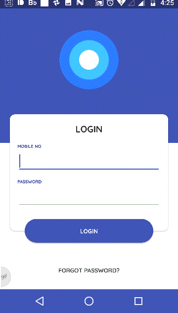

# **Kotlin Sample - MVP Architecture**


This Project is mainly focused on implementing MVP Pattern in Android with Kotlin.

The repository contains simple Login screen and welcome screen with the following learnings.
    
* Kotlin
* MVP Architecture

Also, the MVP Architecture is inspired from [Mindorks MVP Android Architecture](https://github.com/MindorksOpenSource/android-mvp-architecture), but concentrates on demonstrating the architecture without introducing the third party libraries like Dependency Injection(Dagger) and RxJava.

----------

### Thanks ###  

* [Behnam Sobhkhiz](https://www.uplabs.com/behnamsobhkhiz) for his brilliant Login screen design.
* [Mindorks Community](http://github.com/mindorksOpenSource/) for their excellent implementation of MVP Architecture.

----------

### Download ###

You can download the sample [here.](https://firebasestorage.googleapis.com/v0/b/friendly-chat-4a901.appspot.com/o/app-debug.apk?alt=media&token=654fccba-fbb5-44eb-9a0a-c06396f3e215)

Do login with the following credentials 

> Mobile no - 8812345678   
> Password - saymyname
----------

### Demo ###


### Screenshots ###

Login screen                                  |  Main Screen                                 |  
:--------------------------------------------:|:--------------------------------------------:|
  |  |

---------

### Yet to finish ###

* Test cases
* Implementing Broadcast
* Service
* And more

---------

### License
```
   Copyright (C) 2017 Mathan raj

   Licensed under the Apache License, Version 2.0 (the "License");
   you may not use this file except in compliance with the License.
   You may obtain a copy of the License at

       http://www.apache.org/licenses/LICENSE-2.0

   Unless required by applicable law or agreed to in writing, software
   distributed under the License is distributed on an "AS IS" BASIS,
   WITHOUT WARRANTIES OR CONDITIONS OF ANY KIND, either express or implied.
   See the License for the specific language governing permissions and
   limitations under the License.
```
