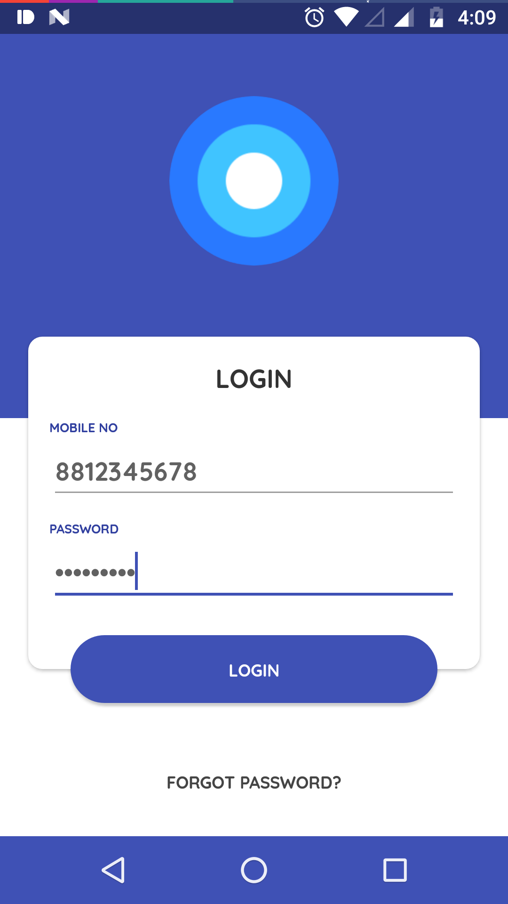

#**Kotlin Sample - MVP Architecture**

----------

This Project is mainly focused on implementing MVP Pattern in Android with Kotlin. Also, it concentrates on best practices like **De-coupling** and **Moduling**.

A simple Login Sample with the following learnings.    
    
: Kotlin  
: MVP Architecture

Also, MVP Architecture is mainly inspired from [Mindorks MVP Android Architecture](https://github.com/MindorksOpenSource/android-mvp-architecture)

Thanks to [Behnam Sobhkhiz](https://www.uplabs.com/behnamsobhkhiz) for his brilliant Login screen design.

----------

##Screenshots##

###Login screen###

###Main screen###

###Demo###

